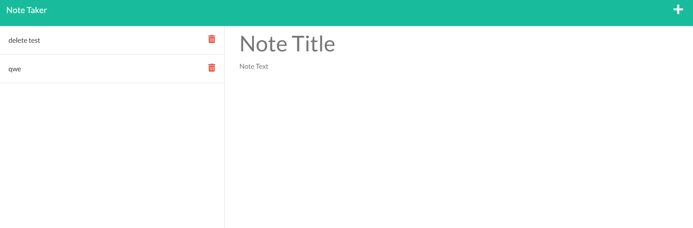

# Vince's-Note-Taker
This note taker is used to take notes of anything you need to remember in the future

### Website Features:
1) A cover page that directs the user to the application
2) A notes section that allows the user to create a title and note.
3) Upon writing a title and note, a save button appears and the data is saved to a JSON file
4) The notes data persists even when closing and reopening the server or 

### What I learned from the creation of this site:
* Better understanding of express.js GET, POST, and DELETE
* How to modularize files with the express framework
* Writing and deleting files from a .json file so that data persists
* Depoying applications to Heroku

[This is a link to the deployed Heroku site](https://note-taker-by-vince.herokuapp.com/)

Screenshots of the site:

